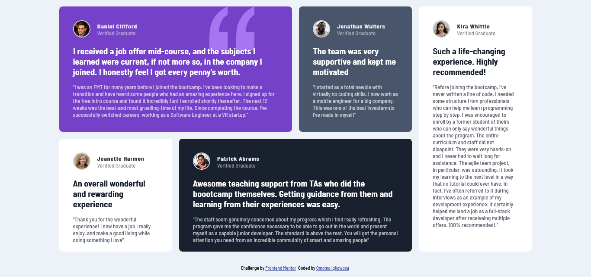

## Welcome! 👋

# Frontend Mentor - Testimonials grid section solution

This is a solution to the [Testimonials grid section challenge on Frontend Mentor](https://www.frontendmentor.io/challenges/testimonials-grid-section-Nnw6J7Un7). Frontend Mentor challenges help you improve your coding skills by building realistic projects.

## Table of contents

-   [Overview](#overview)
    -   [The challenge](#the-challenge)
    -   [Screenshot](#screenshot)
    -   [Links](#links)
-   [My process](#my-process)
    -   [Built with](#built-with)
    -   [What I learned](#what-i-learned)
    -   [Continued development](#continued-development)
## Overview
This project is a responsive testimonial page showcasing success stories of coding bootcamp graduates. Built with HTML and CSS, it features feedback from verified graduates who have transitioned into software engineering careers. The design emphasizes visual appeal with avatar images, distinct backgrounds, and a modern font. The code follows best practices, ensuring maintainability and scalability. This project demonstrates my design skills and proficiency in HTML and CSS
### The challenge

Users should be able to:

-   View the optimal layout for the site depending on their device's screen size

### Screenshot



### Links

-   Solution URL: [Solution URL ](https://github.com/Ig-Matrix/Frontend-Mentor---Testimonials-grid-section-solution)
-   Live Site URL: [Live site URL ](https://ig-matrix.github.io/Frontend-Mentor---Testimonials-grid-section-solution/)

## My process
- Testimonial Page for a Coding Bootcamp
This project is a responsive testimonial page designed for a coding bootcamp. It showcases the experiences and feedback of various graduates, highlighting their successful career transitions and the impact of the bootcamp on their lives. The page layout is created using HTML and styled using CSS.

- Features and Functionality
The page is structured using semantic HTML elements, making it easily readable and accessible.
CSS Grid is utilized to create a responsive and visually appealing layout for the testimonials.
Each testimonial section includes an avatar image, graduate's name, and their feedback statement.
The testimonials are styled with different background colors and images, providing visual variety.
The page is fully responsive, adapting to different screen sizes and orientations.
The font used throughout the page is "Barlow Semi Condensed," imported from Google Fonts.
The project includes a favicon and external CSS file for better organization and maintainability.

### Built with

-   Semantic HTML5 markup
-   CSS custom properties
-   Flexbox
-   CSS Grid
-   Mobile-first workflow

### What I learned

I learnt more about CSS grids.  Implementing CSS Grid layout enhanced the flexibility and responsiveness of my design. It allowed for easy positioning and alignment of elements in a grid structure.
Some CSS code I'm proud of;

```css
main {
    display: grid;
    grid-template-columns: repeat(4, 1fr);
    grid-template-rows: 1fr 0.5fr;
    grid-template-areas:
        "box1 box1 box2 box5"
        "box3 box4 box4 box5";
}

```

```css
@media screen and (min-width: 768px) {
    main {
        grid-template-columns: 1fr;
        grid-template-rows: 1fr .6fr .6fr .8fr 1fr;
        grid-template-areas:
            "box1"
            "box2"
            "box3"
            "box4"
            "box5";
    }
}

```

### Continued development
1. Enhanced Responsiveness: Further improvement of the responsiveness of the testimonial page to ensure optimal viewing on various devices and screen sizes. I feel the need to implement additional media queries or adjust existing ones to refine the layout and styling.

2. Interactive Elements: I want to introduce interactive elements such as hover effects, transitions, or animations to add more interactivity and engagement to the testimonial page.

## Author
-   Website - [Omoma Ighawosa](https://ig-matrix.github.io/Lesson_3_Task_6_Omoma_Ighawosa/)
-   Frontend Mentor - [@Ig-Matrix](https://www.frontendmentor.io/profile/Ig-Matrix)
-   Twitter - [@I_am_ig_matrix](https://twitter.com/i_am_Ig_matrix)
